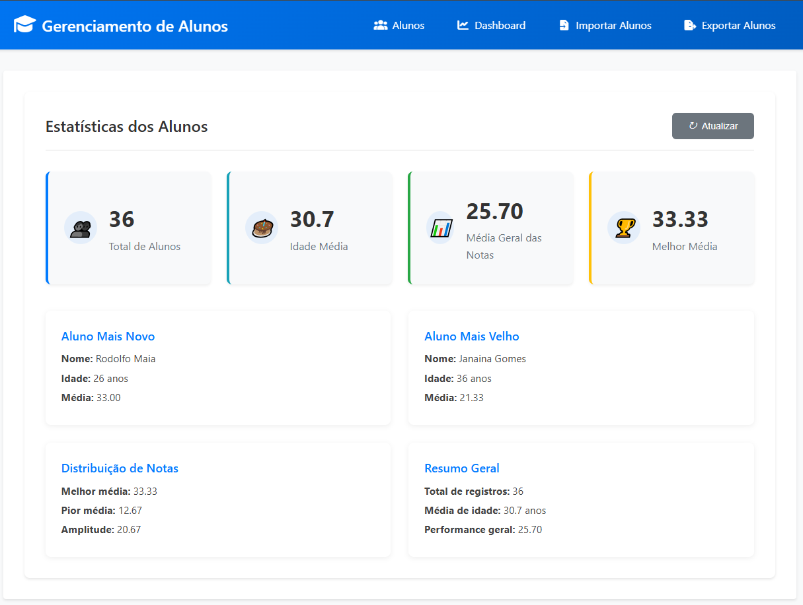

# 🎓 Sistema de Gerenciamento de Alunos



Sistema completo Spring Boot + Angular para importação, processamento, cálculo de estatísticas e exportação de dados de alunos via planilhas Excel e API REST.

> **✅ Frontend Angular agora incluso:** O repositório agora contempla tanto o backend Spring Boot quanto o frontend Angular completo, organizados em subpastas dedicadas (`/backend` e `/frontend`).
---

## 1. Contexto Geral

Este projeto implementa um sistema completo full-stack para manipulação de dados de alunos, incluindo leitura de planilhas Excel, cálculo de estatísticas e exposição de dados via API REST. O backend foi desenvolvido em Spring Boot e o frontend em Angular 20+, proporcionando uma experiência de usuário moderna e responsiva.

---

## 2. Requisitos Funcionais e Técnicos

### 2.1. Backend (Java + Spring Boot)

- **Leitura de arquivo Excel** (.xlsx) enviado via API
- **Persistência dos dados** dos alunos (identificação, nome, data de nascimento, notas) em MySQL via JPA/Hibernate
- **Cálculo de estatísticas:**
  - Nome
  - Idade (calculada)
  - Média das notas (aritmética)
- **Disponibilização dos dados** via endpoints REST (JSON)
- **Exportação em Excel** com mesma estrutura da visualização (diferencial implementado)
- **API documentada** com Swagger/OpenAPI
- **Validação, tratamento e manipulação** de entradas

### 2.2. Frontend (Angular 20+)

- **Dashboard de Estatísticas:** Visão geral completa com métricas avançadas incluindo total de alunos, idade média, média geral das notas, melhor média, identificação de alunos mais novos/velhos, distribuição de notas e resumo geral
- **Listagem de Alunos:** Tabela detalhada e responsiva exibindo identificação, nome, idade e média das notas, ordenada por idade crescente, com funcionalidade de atualização em tempo real
- **Importação de Excel:** Interface intuitiva de drag-and-drop para upload de arquivos .xlsx, com feedback visual, indicadores de progresso, mensagens de sucesso/erro e validação de formato
- **Exportação de Dados:** Tela dedicada para download de planilhas Excel processadas, mostrando preview dos dados a serem exportados (total de registros, formato, colunas incluídas)
- **Navegação SPA:** Roteamento Angular moderno entre páginas com menu superior intuitivo
- **Comunicação RESTful:** Integração total com endpoints do backend via HttpClient
- **UX/UI Responsiva:** Design moderno e responsivo com componentes standalone Angular

---

## 3. Stack Tecnológico

- **Java 21+**
- **Spring Boot 3.5.x** (Web, Data JPA, Validation)
- **Hibernate** (JPA)
- **MySQL 8+**
- **Lombok**
- **Apache POI** (leitura/escrita Excel)
- **JUnit 5** (testes)
- **Swagger/OpenAPI**
- **Maven**
- **Angular** 

## 4. Estrutura do Projeto

## Backend
```
br.com.rodartenogueira.backend
├── config
├── controller
├── dto
├── enums
├── exception
├── model
├── repository
├── service
│   └── impl
└── test
    └── java
        └── br.com.rodartenogueira.backend
            ├── controller
            │   └── integration
            └── service
                └── impl
                    └── integration
```

## Frontend
```
frontend/
└── src
    ├── app
    │   ├── core
    │   │   ├── interceptors
    │   │   └── services
    │   ├── features
    │   │   └── aluno
    │   │       ├── components
    │   │       │   ├── aluno-dashboard
    │   │       │   ├── aluno-export
    │   │       │   ├── aluno-import
    │   │       │   └── aluno-list
    │   │       ├── models
    │   │       └── services
    │   ├── shared
    │   │   ├── components
    │   │   │   ├── file-upload
    │   │   │   ├── loading-spinner
    │   │   │   └── notification
    │   │   └── models
    └── environments
```

---

## 5. Instruções de Execução

### 5.1. Pré-requisitos

- **Java 21+**
- **MySQL 8+** (rodando)
- **Maven 3.8+**
- **Node.js**
- **Angular CLI 20+**

### 5.2. Executando o Backend

```bash
cd backend
./mvnw spring-boot:run
```

**Configure o banco MySQL** em `src/main/resources/application.properties`:

```properties
spring.datasource.url=jdbc:mysql://localhost:3306/rodarte_db?serverTimezone=America/Sao_Paulo&useSSL=false
spring.datasource.username=SEU_USUARIO
spring.datasource.password=SUA_SENHA
spring.jpa.hibernate.ddl-auto=update
```

### 5.3. Executando o Frontend

```bash
cd frontend
npm install
ng serve
```

**Acesse a aplicação:** `http://localhost:4200`

---

## 6. Páginas e Componentes do Frontend

### 6.1. Dashboard de Estatísticas (`/dashboard`)
Tela principal com visão geral completa do sistema, apresentando:
- **Cards de métricas:** Total de alunos, idade média, média geral das notas, melhor média
- **Informações destacadas:** Aluno mais novo e mais velho (nome, idade, média)
- **Distribuição de notas:** Melhor média, pior média, amplitude
- **Resumo geral:** Total de registros, média de idade, performance geral
- **Atualização em tempo real** via botão "Atualizar"

### 6.2. Lista de Alunos (`/alunos`)
Tabela responsiva e completa exibindo:
- **Colunas:** Identificação, Nome, Idade, Média das Notas
- **Ordenação:** Por idade crescente (conforme regra de negócio)
- **Atualização dinâmica** dos dados
- **Design responsivo** para diferentes dispositivos

### 6.3. Importação de Alunos (`/importar`)
Interface de upload intuitiva com:
- **Área de drag-and-drop** para seleção de arquivos Excel
- **Botão "Selecionar Arquivo"** como alternativa
- **Validação de formato** (.xlsx)
- **Feedback visual** durante upload
- **Mensagens de sucesso/erro** detalhadas
- **Instruções claras** sobre formato esperado

### 6.4. Exportação de Dados (`/exportar`)
Tela dedicada para download com:
- **Preview dos dados** a serem exportados
- **Informações do arquivo:** Total de registros, formato Excel (.xlsx)
- **Colunas incluídas:** Identificação, Nome, Idade, Média das Notas
- **Botões de ação:** Atualizar contagem e Exportar Excel
- **Feedback de processamento**

---
## 7. Integração Frontend-Backend

### 7.1. Comunicação RESTful
O frontend Angular integra-se perfeitamente com o backend através dos endpoints REST:

- **GET `/api/alunos/estatisticas`** → Dashboard e Lista de Alunos
- **POST `/api/alunos/importar`** → Upload de arquivos Excel
- **GET `/api/alunos/exportar`** → Download de planilhas processadas

### 7.2. Arquitetura de Serviços
- **AlunoService:** Centraliza todas as chamadas HTTP ao backend
- **Componentes Standalone:** Arquitetura Angular moderna sem módulos
- **Roteamento SPA:** Navegação fluida entre páginas
- **Tratamento de erros:** Feedback consistente ao usuário

---
## 8. Testes Automatizados

- **Testes unitários** (JUnit 5, Mockito) para service e controller
- **Teste de integração** para todos os endpoints principais

**Para executar os testes:**
```bash
./mvnw test
```

---

## 9. Diferenciais Entregues

- **Testes unitários e de integração** cobrindo validação e APIs REST
- **API totalmente documentada** via Swagger (`http://localhost:8080/swagger-ui.html`)

---

### Observações Técnicas
- **Timezone do banco:** utiliza `America/Sao_Paulo`

---